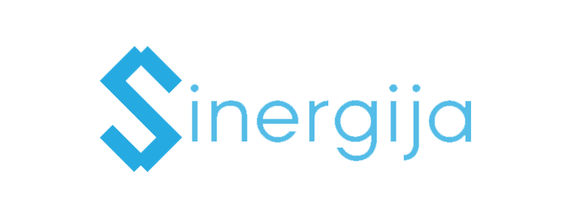

## Description

_Sinergija_ is a web aplication whose purpose is to speed up and aid in various organizational activities in [OMIKRON](http://omikron.org.rs), Faculty of Mathematics's student organization. The application provides a way to easily track members' tasks and to simplify communication between team members.

## Goals

1. Speed up and improve workflows in OMIKRON.
2. Centralize task management and tracking.
3. Use one platform for member communication.

## Additional information

This project is the web API reimplementation and modernization of an old project, which you can find [here](https://github.com/ajzenhamernikola/Sinergija) (in Serbian only).
